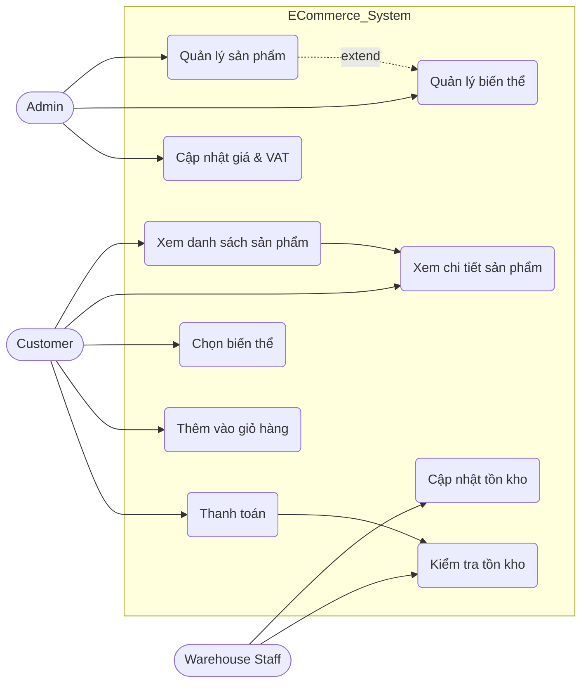
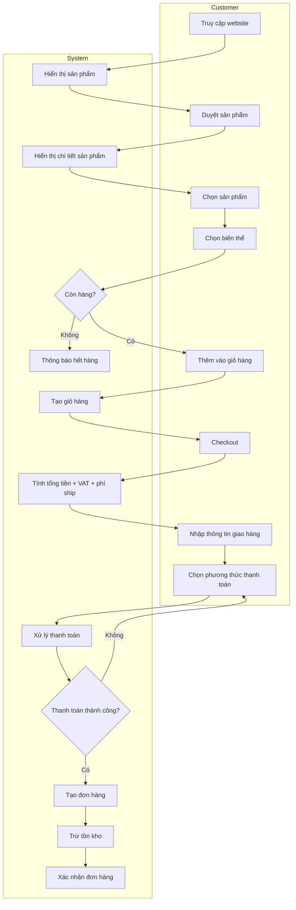

# Software Requirement Specification (SRS)

---

## Hệ thống: Kochi Lens E-commerce

---

## Module: Product Information Management (PIM)
Mã chức năng: ECOM-PIM-01
Trạng thái: Draft / Review
Người soạn thảo: Trịnh Duy Nam
Vai trò: Technical Writer / Student

---

# 1. Mô hình hóa quy trình

## 1.1 Actors

- **Admin**: Quản lý sản phẩm, biến thể, giá bán  
- **Customer**: Xem và mua sản phẩm  
- **Warehouse Staff**: Quản lý và cập nhật tồn kho  

## 1.2 Use Case Diagram

## 1.3 Activity Diagram

## 1.4 Mô tả luồng nghiệp vụ (Business Flow Description)

Luồng xử lý đặt hàng trong hệ thống E-commerce Kochi Lens được mô tả như sau:

1. Customer truy cập vào website bán hàng  
2. Customer duyệt danh sách sản phẩm hoặc tìm kiếm sản phẩm mong muốn  
3. Customer chọn một sản phẩm cụ thể  
4. Customer chọn biến thể (màu sắc, kích thước) của sản phẩm  
5. Hệ thống kiểm tra tồn kho của sản phẩm  
   - Nếu hết hàng → hiển thị thông báo “Out of stock”  
   - Nếu còn hàng → cho phép tiếp tục  
6. Customer thêm sản phẩm vào giỏ hàng  
7. Customer tiến hành checkout  
8. Customer nhập thông tin giao hàng  
9. Customer chọn phương thức thanh toán (VNPay/Momo)  
10. Hệ thống xử lý thanh toán  
11. Nếu thanh toán thành công:  
    - Hệ thống tạo đơn hàng  
    - Hệ thống trừ tồn kho  
    - Hệ thống xác nhận đơn hàng  
12. Nếu thanh toán thất bại:  
    - Hệ thống yêu cầu thanh toán lại  

---

# 2. Đặc tả chức năng (Functional Requirements)

## 2.1 Product Management

- Là một **Admin**, tôi muốn tạo sản phẩm để đưa sản phẩm lên hệ thống  
- Là một **Admin**, tôi muốn chỉnh sửa thông tin sản phẩm để cập nhật giá và mô tả  
- Là một **Admin**, tôi muốn xóa sản phẩm để ngừng kinh doanh  

---

## 2.2 Variant Management

- Là một **Admin**, tôi muốn tạo các biến thể (màu sắc, kích thước) cho sản phẩm  
- Là một **Admin**, tôi muốn gán SKU riêng cho từng biến thể để quản lý tồn kho  
- Là một **Customer**, tôi muốn chọn biến thể phù hợp khi mua sản phẩm  

---

## 2.3 Inventory Management

- Là một **Warehouse Staff**, tôi muốn cập nhật số lượng tồn kho để đảm bảo dữ liệu chính xác  
- Là một **System**, tôi muốn tự động trừ tồn kho khi đơn hàng được xác nhận  
- Là một **Customer**, tôi muốn xem trạng thái còn hàng hoặc hết hàng theo thời gian thực  

---

## 2.4 Customer Purchase Flow

- Là một **Customer**, tôi muốn xem danh sách sản phẩm để lựa chọn  
- Là một **Customer**, tôi muốn xem chi tiết sản phẩm (giá, mô tả, biến thể)  
- Là một **Customer**, tôi muốn thêm sản phẩm vào giỏ hàng  
- Là một **Customer**, tôi muốn nhập thông tin giao hàng  
- Là một **Customer**, tôi muốn chọn phương thức thanh toán  
- Là một **Customer**, tôi muốn nhận xác nhận đơn hàng sau khi thanh toán  

---

# 3. Đặc tả dữ liệu (Data Schema)

Phần này mô tả cấu trúc dữ liệu chính được sử dụng trong hệ thống E-commerce Kochi Lens.

---

## 3.1 Partner (Khách hàng)

Đại diện cho thông tin khách hàng mua hàng trên hệ thống, bao gồm cả khách cá nhân (B2C) và doanh nghiệp (B2B).

| Field        | Type    | Required | Description                          |
|-------------|--------|----------|--------------------------------------|
| partner_id  | UUID   | Yes      | Định danh duy nhất của khách hàng    |
| name        | String | Yes      | Tên khách hàng                       |
| tax_code    | String | No       | Mã số thuế (áp dụng cho khách B2B)  |
| email       | String | Yes      | Email liên hệ                        |
| phone       | String | Yes      | Số điện thoại                        |
| address     | String | Yes      | Địa chỉ giao hàng                    |
| partner_type| Enum   | Yes      | Guest / B2C / B2B                    |

---

## 3.2 Product (Sản phẩm)

Lưu trữ thông tin chung của sản phẩm.

| Field        | Type    | Required | Description              |
|--------------|--------|----------|--------------------------|
| product_id   | UUID   | Yes      | Định danh sản phẩm       |
| name         | String | Yes      | Tên sản phẩm             |
| description  | Text   | No       | Mô tả sản phẩm           |
| sku          | String | Yes      | Mã SKU sản phẩm          |
| barcode      | String | No       | Mã vạch                  |
| price        | Float  | Yes      | Giá bán                  |
| vat          | Float  | Yes      | Thuế VAT (%)             |
| status       | Enum   | Yes      | Active / Inactive        |

---

## 3.3 Product Variant (Biến thể sản phẩm)

Mỗi sản phẩm có thể có nhiều biến thể (màu sắc, kích thước).

| Field        | Type    | Required | Description              |
|--------------|--------|----------|--------------------------|
| variant_id   | UUID   | Yes      | ID biến thể              |
| product_id   | UUID   | Yes      | Liên kết tới Product     |
| color        | String | No       | Màu sắc                  |
| size         | String | No       | Kích thước               |
| sku          | String | Yes      | SKU riêng cho biến thể   |
| price        | Float  | Yes      | Giá bán                  |
| stock_qty    | Int    | Yes      | Số lượng tồn kho         |

---

## 3.4 Order (Đơn hàng)

Lưu thông tin đơn hàng của khách.

| Field         | Type    | Required | Description                           |
|---------------|--------|----------|---------------------------------------|
| order_id      | UUID   | Yes      | ID đơn hàng                           |
| order_number  | String | Yes      | Số đơn hàng                           |
| partner_id    | UUID   | Yes      | Liên kết tới khách hàng               |
| total_amount  | Float  | Yes      | Tổng tiền                             |
| tax_amount    | Float  | Yes      | Tổng thuế                             |
| shipping_fee  | Float  | Yes      | Phí vận chuyển                        |
| status        | Enum   | Yes      | Draft / Confirmed / Cancelled         |
| created_at    | DateTime | Yes    | Thời điểm tạo đơn                     |

---

## 3.5 Quan hệ dữ liệu (Data Relationships)

- Một **Partner** có thể có nhiều **Order** (1-N)  
- Một **Product** có thể có nhiều **Variant** (1-N)  
- Một **Order** thuộc về một **Partner**  
- Một **Variant** thuộc về một **Product**  

---

## 3.6 Ràng buộc dữ liệu (Constraints)

- SKU phải là duy nhất trong hệ thống  
- Stock quantity (stock_qty) ≥ 0  
- Giá sản phẩm (price) > 0  
- Order chỉ được chuyển sang trạng thái "Confirmed" khi thanh toán thành công  

---

# 4. Non-functional Requirements

## 4.1 Performance (Hiệu năng)
- Hệ thống phải phản hồi trong vòng **≤ 2 giây** đối với các thao tác thông thường (xem sản phẩm, thêm vào giỏ hàng)
- Thời gian xử lý thanh toán không vượt quá **5 giây**
- Hệ thống hỗ trợ tối thiểu **1000 người dùng đồng thời**

---

## 4.2 Availability (Khả dụng)
- Hệ thống đảm bảo uptime tối thiểu **99.5%**
- Có cơ chế backup dữ liệu định kỳ (daily backup)
- Có khả năng phục hồi khi xảy ra sự cố (disaster recovery)

---

## 4.3 Security (Bảo mật)
- Thông tin khách hàng phải được mã hóa khi truyền tải (HTTPS)
- Không lưu trữ thông tin thanh toán nhạy cảm (theo chuẩn PCI-DSS)
- Xác thực và phân quyền người dùng (Admin / Customer / Warehouse)
- Ngăn chặn truy cập trái phép vào dữ liệu

---

## 4.4 Scalability (Khả năng mở rộng)
- Hệ thống có thể mở rộng để phục vụ số lượng lớn sản phẩm và người dùng
- Có thể tích hợp thêm các cổng thanh toán khác trong tương lai

---

## 4.5 Usability (Khả dụng người dùng)
- Giao diện thân thiện, dễ sử dụng
- Hỗ trợ trên nhiều thiết bị (desktop, mobile)
- Quy trình mua hàng tối đa 3–5 bước

---

## 4.6 Reliability (Độ tin cậy)
- Dữ liệu đơn hàng không được mất trong mọi trường hợp
- Các giao dịch thanh toán phải đảm bảo tính toàn vẹn (atomic)

---

# 5. Exception Handling (Các trường hợp ngoại lệ)

## 5.1 Hết hàng (Out of Stock)
- Khi sản phẩm hết hàng:
  - Hệ thống hiển thị thông báo “Hết hàng”
  - Không cho phép thêm vào giỏ hàng

---

## 5.2 Thanh toán thất bại
- Nếu thanh toán không thành công:
  - Hệ thống hiển thị thông báo lỗi
  - Cho phép người dùng thử lại thanh toán
  - Không tạo đơn hàng

---

## 5.3 Gián đoạn kết nối
- Nếu mất kết nối trong quá trình đặt hàng:
  - Dữ liệu giỏ hàng vẫn được lưu tạm
  - Người dùng có thể tiếp tục khi kết nối lại

---

## 5.4 Dữ liệu không hợp lệ
- Nếu người dùng nhập sai thông tin:
  - Hệ thống hiển thị lỗi (email sai format, thiếu địa chỉ…)
  - Không cho phép tiếp tục checkout

---

## 5.5 Lỗi hệ thống
- Khi xảy ra lỗi server:
  - Hiển thị thông báo “Hệ thống đang bảo trì”
  - Ghi log lỗi để xử lý

---

## 5.6 Trùng SKU
- Nếu Admin nhập SKU đã tồn tại:
  - Hệ thống không cho phép lưu
  - Hiển thị thông báo lỗi

---

## 5.7 Tồn kho không đủ khi checkout
- Nếu sản phẩm hết hàng trong lúc checkout:
  - Hệ thống cập nhật lại giỏ hàng
  - Yêu cầu người dùng điều chỉnh số lượng

---

# 6. Kết luận

Tài liệu SRS đã mô tả đầy đủ:
- Quy trình nghiệp vụ
- Yêu cầu chức năng
- Cấu trúc dữ liệu
- Yêu cầu phi chức năng
- Các trường hợp ngoại lệ

Đây là cơ sở để thiết kế và phát triển hệ thống E-commerce Kochi Lens.